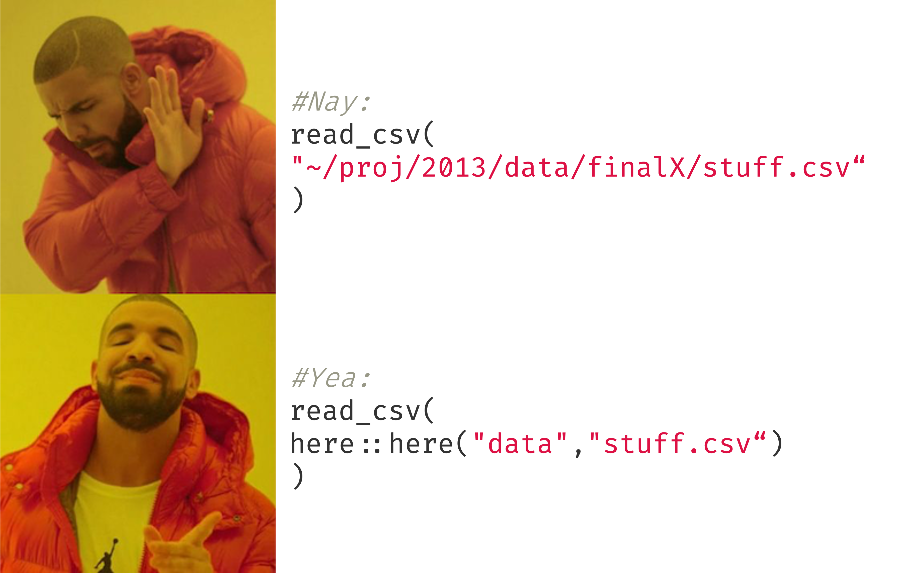
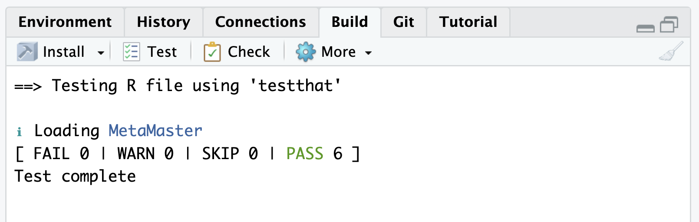
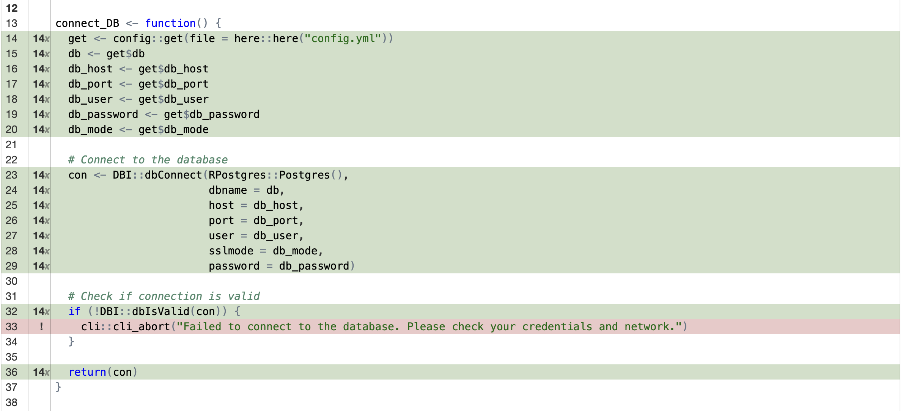

class: center, middle


```{r setup, include=FALSE}
options(htmltools.dir.version = FALSE)

library(ggplot2)
library(tidyverse)
library(readr)
library(gridExtra)
library(cowplot)

#library(jtools)


knitr::opts_chunk$set(fig.retina = 3, warning = FALSE, message = FALSE)


theme_set(theme_minimal(base_size = 20)) # sets a default ggplot theme

has_bash <- Sys.which('bash') != '' && .Platform$OS.type != 'windows'

library(RefManageR)
bib <- ReadBib("PracticeR_FINAL.bib", check = FALSE)
ui <- "- "
```


```{r best-features, echo=FALSE}
#search
xaringanExtra::use_search(show_icon = TRUE, position = "top-right")

xaringanExtra::use_progress_bar(color = "#023047", location = "top")

xaringanExtra::style_search(match_background = "black",
                            input_background = "white",
                            input_border = "black",
                            match_current_background = "green")


xaringanExtra::use_panelset()

```


```{r xaringan-themer, include=FALSE, warning=FALSE}
library(xaringanthemer)
style_mono_accent(
  base_color = "black",
  header_font_google = google_font("Lato"),
  text_font_google   = google_font("Montserrat", "300", "300i"),
  code_font_google   = google_font("Fira Code")
)
```


  
# Make it reproducibleR
## These slides are work in progess

.large[Dr. Edgar J. Treischl] <br>
<a href="http://www.edgar-treischl.de" target="_blank">www.edgar-treischl.de</a>
<br/>
<br/>
.large[Last update: `r Sys.Date()`]
<br/>
<br/>
This presentation is licensed under a CC-BY-NC 4.0 license.
You may copy, distribute, and use the slides in your own work, as long as you give attribution to the original author on each slide that you use. Commercial use of the contents of these slides is not allowed.


```{css, echo = F}
.reduced_opacity {
  opacity: 0.5;
}
```


---
## `r emoji::emoji("schedule")` Agenda


.pull-left[


### `r emoji::emoji("one")` Develop
### `r emoji::emoji("two")`  Build
### `r emoji::emoji("three")`  Document
### `r emoji::emoji("four")`  Deploy


]

.pull-right[


]


---
background-image: url("images/hitrobin.gif")
background-size: cover
class: bottom, center


## .white[Develop, but get rid of bad habits first `r emoji::emoji("smile")`] 


---
## 01: Start with a clean slate ...

.pull-left[

- and restart R: Do not save the workspace and do not load the workspace from an `.Rdata` file (Based on Bryan et al. 2021). 


### Abandon the rm approach `r emoji::emoji("skull")`

- `rm(list = ls())` deletes user-created objects from the global workspace.

- The script may break due to hidden dependencies on things you ran in this R process before you executed: Attached packages are not detached, changed options are not restored, working directory is untouched!


]

.pull-right[
<figure>
    
</figure>
]


---

## 01: Don't Go Places Where You Don't Belong




---

## 01: Fix paths with the here package

### Abandon absolute paths, they will break anyway `r emoji::emoji("skull")`


```{r, eval=FALSE}
#Don't:
readr::read_csv("~/Documents/Berichte/orig/104_data.csv")
```

Create a project and use the `here` package:

```{r}
#Here returns the path to the project
here::here()
```


```{r, eval=TRUE}
#Create a path to the data file
here::here("data", "descriptive_title.csv")
```


---


## 01: R vs. Rmd

### `r emoji::emoji("finger")` Code lives in .R files, Code and Text in Rmd

If you need to create a document from a source code, run:

```{r, eval=FALSE}
#spin converts an R script to an Rmd file
knitr::spin("script.R")
```

- Roxygen comments will be treated as text (more about that later)
- Add yaml header to the script to control the output


If you need to extract the code from an Rmd file, run:


```{r, eval=FALSE}
#Extracts R code chunks from Rmd files
knitr::purl()
```

- Adjust the level of extraction with the `documentation` parameter (e.g., code only)
- Set `purl = FALSE` to avoid the extraction of code chunks


---
background-image: url("images/away.gif")
background-size: cover
class: bottom, center


# .red[Keep your version under control] 

---
background-image: url(https://github.githubassets.com/assets/GitHub-Mark-ea2971cee799.png)
background-position: 90% 5%
background-size: 8%

## 01: Git(Hub)

### Track changes over time

<figure>
    <a href="https://r-pkgs.org" target="_blank"> <figcaption style = "color: darkgray;">'Hadley Wickham and Jennifer Bryan'</figcaption>
</figure>


---
background-image: url(https://styler.r-lib.org/reference/figures/logo.png)
background-position: 90% 5%
background-size: 8%

## 01: Develop With Style(r)


.pull-left[

<div class="info-box">
  <i>ℹ️️</i> "styler formats your code according to the tidyverse style guide (https://style.tidyverse.org) (or your custom style guide) so you can direct your attention to the content of your code".
</div>


]

.pull-right[

```{r}
styler::style_text(
  "myFunction<-function( x,y){
  if(sum( x , y )==10){
    print( 'Sum is correct!' )
  }
}"
)

```

]


---
background-image: url(https://github.com/r-lib/lintr/blob/main/man/figures/logo.png)
background-position: 90% 5%
background-size: 8%

## 01: Lint

<br/>

.pull-left[

<div class="info-box">
  <i>`r emoji::emoji("lightning")`️</i>"lintr provides static code analysis for R. It checks for adherence to a given style, identifying syntax errors and possible semantic issues, then reports them to you so you can take action. ".
</div>


]

.pull-right[

```{r}
lintr::lint(text = 'myFunction <- function(x, y) {
  if (sum(x, y) == 10) {
    print("Sum is correct!")
  }
}')
```

]


---
background-image: url("images/gotham.gif")
background-size: cover
class: bottom, center


## .white[Let's build ... `r emoji::emoji("evil")`] 


---
## 02 Build: R Packages

.pull-left[


- *Reusability and Distribution*: Make sure everything is under the hood and share with the world. Plus: simplifies version control, dependency management, and installation
- *Organization and Maintainability*: A package encourages a clean and organized structure for your code (functions, documentation, tests), making it easier to maintain, update, and extend over time.

- *Documentation*: A package allows you to include automatic documentation (help files, website, vignettes) , making it much easier for others - and the future yourself - to understand how it works.


]

.pull-right[
<figure>
    <a href="https://r-pkgs.org" target="_blank"> <figcaption style = "color: darkgray;">'Hadley Wickham and Jennifer Bryan'</figcaption>
</figure>
]


---
## 02 Build: usethis

.pull-left[

### Automate package and project setup with usethis

```{r, eval =FALSE}
#Create a new package
usethis::create_package("path/to/package")
```

```{r, eval = FALSE}
#Add a package in the DESCRIPTION file
usethis::use_package("ggplot2")
```


```{r, eval = FALSE}
#Add a readme file
usethis::use_readme_rmd()
```


]

.pull-right[
<figure>
    <a href="https://usethis.r-lib.org/" target="_blank">
</figure>
]


---
background-image: url(https://usethis.r-lib.org/logo.png)
background-position: 90% 5%
background-size: 8%
## 02 Build: Github Actions

.pull-left[

Continuous Integration/Continuous Deployment:

1. *Reliability via Automated Testing*: We can automatically run tests on every commit, ensuring that code changes don't break functionality.

2. *Consistent Environments*: CI/CD pipelines define reproducible environments, ensuring that the code runs the same way on every machine, regardless the local setup.

3. *Effortless Deployment*: With GitHub Actions, you can automate the deployment of R Markdown reports, Shiny apps, R packages, and so on.

]

.pull-right[

```yaml
# Workflow from: https://github.com/r-lib/actions/tree/v2/examples

on:
  push:
    branches: [main, master]
  pull_request:
    branches: [main, master]

name: R-CMD-check

jobs:
  R-CMD-check:
    runs-on: ubuntu-latest
    env:
      GITHUB_PAT: ${{ secrets.GITHUB_TOKEN }}
      R_KEEP_PKG_SOURCE: yes
    steps:
      - uses: actions/checkout@v3

...
```

]


---
background-image: url(https://usethis.r-lib.org/logo.png)
background-position: 90% 5%
background-size: 8%

## 02: Github Actions and usethis


Usethis has predefined worksflows for:

- R CMD check
- test coverage
- ...

```{r, eval = FALSE}
usethis::use_github_action()
# Which action do you want to add? (0 to exit)
# (See <https://github.com/r-lib/actions/tree/v2/examples> for other options) 
# 
# 1: check-standard: Run `R CMD check` on Linux, macOS, and Windows
# 2: test-coverage: Compute test coverage and report to https://about.codecov.io
# 3: pr-commands: Add /document and /style commands for pull requests
```


---
background-image: url("images/test.gif")
background-size: cover
class: bottom, center

# .black[... but don't forget to test `r emoji::emoji("silly")`] 


---
background-image: url(https://testthat.r-lib.org/logo.png)
background-position: 90% 5%
background-size: 8%
## 02: testthat

<br/>

<div class="info-box">
  <i>ℹ️</i> "Testing your code can be painful and tedious, but it greatly increases the quality of your code. testthat tries to make testing as fun as possible, so that you get a visceral satisfaction from writing tests. Testing should be addictive, so you do it all the time."
</div>

<br/>

.pull-left[

```{r, eval =FALSE}
#Set up the test infrastructure
# And build a test
usethis::use_test("name")
```

]

.pull-right[



]


---
background-image: url(https://covr.r-lib.org/reference/figures/logo.png)
background-position: 90% 5%
background-size: 8%
## 02 Build: covr


.panelset[

.panel[.panel-name[Test Coverage]

.pull-left[
"Track test coverage for your R package and view reports locally or (optionally) upload the results to codecov or coveralls."

- Bullet point A
- Bullet point B
- Bullet point C

]
.pull-right[
```{r, eval =FALSE}
#Set up the test infrastructure
# And build a test
usethis::use_test("name")
```

]


]

.panel[.panel-name[Report]


]

.panel[.panel-name[Tracked Source]
 
]

.panel[.panel-name[...]

- Work together
- Host websites for projects
- GitHub Gist
- ...

]
]


---
background-image: url("images/ordinary.gif")
background-size: cover
class: bottom, center


## .red[Documentation] 


---
background-image: url(https://roxygen2.r-lib.org/logo.png)
background-position: 90% 5%
background-size: 8%
## 03 Document: roxygen2

.pull-left[

### Describe your functions and ...

<div class="info-box">
  <i>🪄️</i> "... roxygen2 will process your source code and comments to automatically generate .Rd files in man/, NAMESPACE, and, if needed, the Collate field in DESCRIPTION.". (XX et al.)
</div>


- Help files for your functions will be available

- The pkgdown package will use the roxygen2 comments to create a website for your package

]

.pull-right[


```{r, eval =FALSE}
#' Function title
#' 
#' @description What does this `add` function.
#' 
#' @param x Function parameter.
#' @param y Function parameter.
#'
#' @return A number.
#'
#' @examples
#' add(1, 1)

#' @export
add <- function(x, y) {
  x + y
}
```

]

---


## 03 Document: pkgdown

.pull-left[

<div class="info-box">
  <i>ℹ️</i> "The goal of pkgdown is to make it easy to make an elegant and useful package website with a minimum of work. You can get a basic website up and running in just a couple of minutes. If you’re using GitHub, we recommend setting up pkgdown and GitHub actions to automatically build and publish your site". (Wickham et al.)
</div>


]

.pull-right[
<figure>
    <a href="https://pkgdown.r-lib.org" target="_blank">
</figure>
]

<br>


---
background-image: url(https://pkgdown.r-lib.org/logo.png)
background-position: 90% 5%
background-size: 8%

## 03 Document: pkgdown
<br>
<br>


---
background-image: url(https://pkgdown.r-lib.org/logo.png)
background-position: 90% 5%
background-size: 8%

## 03 Document: pkgdown

### Create a pkgdown website via:

.pull-left[

```{r, eval=FALSE}
#usethis creates config file: => _pkgdown.yml config file
usethis::use_pkgdown()

#Build the website via:
pkgdown::build_site()
```

### `r emoji::emoji("rocket")` via GitHub Actions:

```{r, eval=FALSE}
#Add corresponding GHA to deploy each time you push to GitHub
usethis::use_pkgdown_github_pages
```


]

.pull-right[

```yaml
# _pkgdown.yml
url: https://edgar-treischl.github.io/ProjectX/
template:
  bootstrap: 5
  bootswatch: litera
  bslib:
    base_font: {google: "Solway"}
    heading_font: {google: "Solway"}
navbar:
...
```


]


---
background-image: url("images/wash.gif")
background-size: contain
class: bottom, center


<br>
## .black[Deploy] 


---
background-image: url(https://rstudio.github.io/renv/logo.svg)
background-position: 90% 5%
background-size: 8%

## 04 Deploy: Control the R environment

.pull-left[

-  Create reproducible environments with renv:

- Use `renv::init()` to initiate a new project with renv:
  - Gives you the power of isolation because it creates a project library 
  - Creates a .Rprofile file to load the renv library as long as renv is active
  - The package creates a renv.lock with metadata about every project package so that it can be installed on a new machine

- Use `renv::snapshot()` to create a snapshot of the project environment

- Use `renv::restore()` to restore the project environment


]

.pull-right[

```shell
  "R": {
    "Version": "4.4.1",
    "Repositories": [
      {
        "Name": "CRAN",
        "URL": "https://cloud.r-project.org"
      }
    ]
  },
  "Packages": {
    "markdown": {
      "Package": "markdown",
      "Version": "1.0",
      "Source": "Repository",
      "Repository": "CRAN",
      "Hash": "4584a57f565dd7987d59dda3a02cfb41"}
    }
```


]


---
## 04 Deploy: sessioninfo

```{r}
mysession <- sessioninfo::session_info()
mysession$platform
```


Set the parameter: `to_file = "session.log"`  to export a log file


---
## Control the R environment
### sessioninfo


```{r, eval = FALSE}
sessioninfo::session_info(info = "external")
```

```bash
═ Session info ═══════════════════════════════════════════════════════════════
─ External software ──────────────────────────────────────────────────────────
 setting        value
 cairo          1.17.6
 cairoFT
 pango          1.50.14
 png            1.6.40
 jpeg           9.5
 tiff           LIBTIFF, Version 4.5.0
 tcl            8.6.13
 curl           8.7.1
 ...
──────────────────────────────────────────────────────────────────────────────

```


---
background-image: url(https://rocker-project.org/img/rocker.png)
background-position: 90% 5%
background-size: 8%

## 04 Deploy: docker/rocker

.pull-left[

Create, deploy, and run applications in containers via Docker:

- Container: A standard unit of software that packages up code and all its dependencies so the application runs quickly and reliably from one computing environment to another.

- Dockerfile: A text document that contains all the commands a user could call on the command line to assemble an image.

- Rocker: A project that provides different Docker images for R. Those bundles include the OS, R, (RStudio), and packages.


]

.pull-right[

```shell
# Use a base R image from rocker project (official R Docker image)
FROM rocker/r-ver:4.4.1

# Set a working directory in the container
WORKDIR /app

# Copy a simple R script into the container
COPY hello.R .

# Install necessary R packages (e.g., ggplot2)
RUN R -e "install.packages(c('ggplot2'), repos='https://cloud.r-project.org/')"

# Set the entry point to run the R script
ENTRYPOINT ["Rscript", "hello.R"]
  
```


]


---
class: center, middle

.left-column[

## Keep in touch

#### <a href="https://edgar-treischl.de" target="_blank"><br/>www.edgar-treischl.de</a>
<br/>

#### <a href="https://github.com/edgar-treischl" target="_blank"><br/>edgar-treischl</a>


]

.right-column[


## Thank you for your attention!
<br/>


]


---

## References


```{r, print_refs, results='asis', echo=FALSE, warning=FALSE, message=FALSE}

print(bib[key = "chacon_pro_2014"], 
  .opts = list(check.entries = FALSE, 
               style = "html", 
               bib.style = "authoryear"))

print(bib[key = "shiny"], 
  .opts = list(check.entries = TRUE, 
               style = "html", 
               bib.style = "authoryear"))

print(bib[key = "treischl_practice_2023"], 
  .opts = list(check.entries = FALSE, 
               style = "html", 
               bib.style = "authoryear"))

print(bib[key = "usethis"], 
  .opts = list(check.entries = FALSE, 
               style = "html", 
               bib.style = "authoryear"))

print(bib[key = "devtools"], 
  .opts = list(check.entries = FALSE, 
               style = "html", 
               bib.style = "authoryear"))

```


