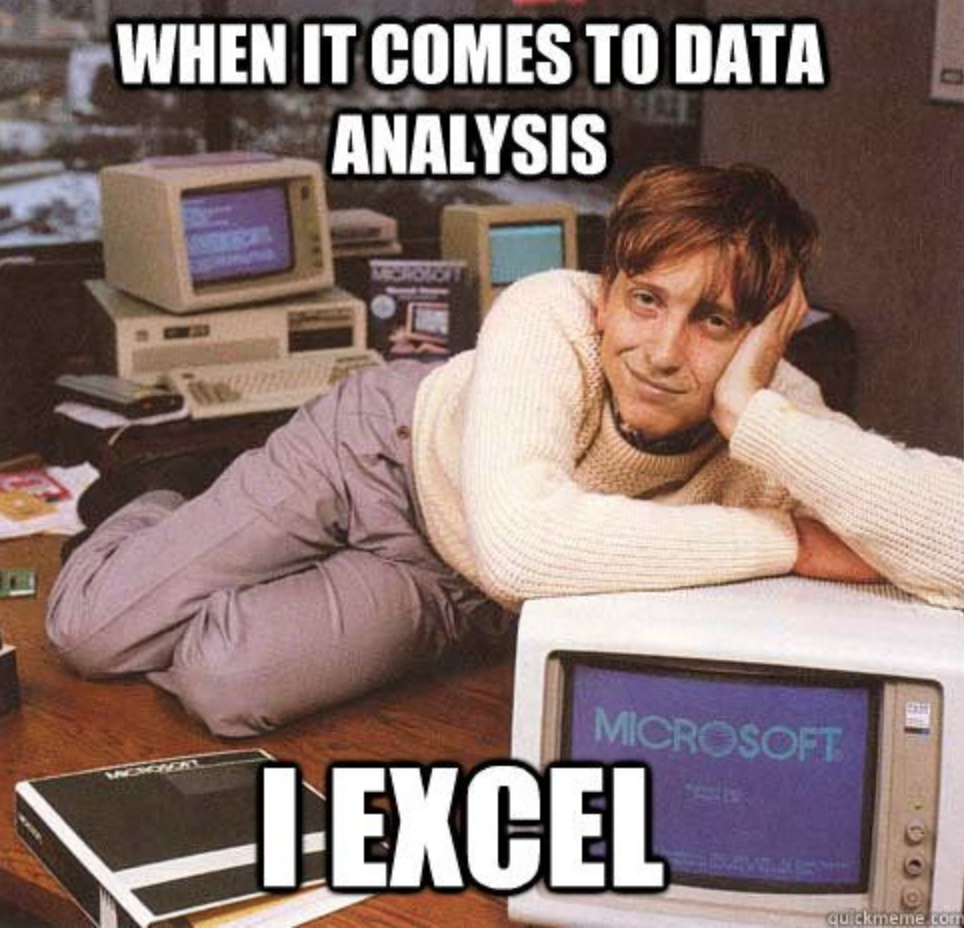
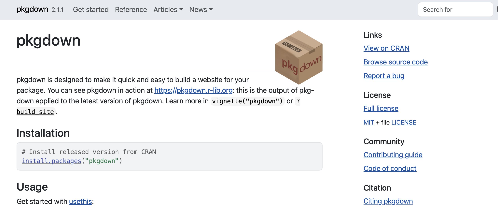
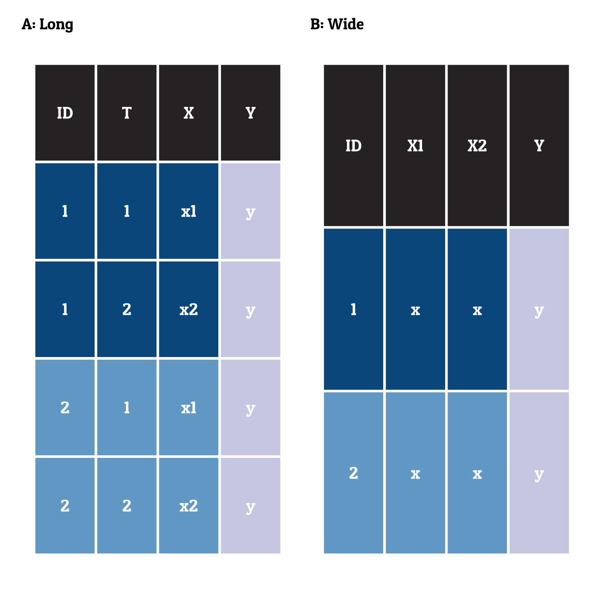

class: center, middle


```{r setup, include=FALSE}
options(htmltools.dir.version = FALSE)

library(ggplot2)
library(tidyverse)
library(readr)
library(gridExtra)
library(cowplot)

#library(jtools)


knitr::opts_chunk$set(fig.retina = 3, warning = FALSE, message = FALSE)


theme_set(theme_minimal(base_size = 20)) # sets a default ggplot theme

has_bash <- Sys.which('bash') != '' && .Platform$OS.type != 'windows'

library(RefManageR)
bib <- ReadBib("PracticeR_FINAL.bib", check = FALSE)
ui <- "- "
```


```{r best-features, echo=FALSE}
#search
xaringanExtra::use_search(show_icon = TRUE, position = "top-right")

xaringanExtra::use_progress_bar(color = "#023047", location = "top")

xaringanExtra::style_search(match_background = "black",
                            input_background = "white",
                            input_border = "black",
                            match_current_background = "green")


xaringanExtra::use_panelset()

```


```{r xaringan-themer, include=FALSE, warning=FALSE}
library(xaringanthemer)
style_mono_accent(
  base_color = "black",
  header_font_google = google_font("Lato"),
  text_font_google   = google_font("Montserrat", "300", "300i"),
  code_font_google   = google_font("Fira Code")
)
```


  
## Make it reproducibleR

## These slides are work in progess

.large[Dr. Edgar J. Treischl] <br>
<a href="www.edgar-treischl.de" target="_blank">www.edgar-treischl.de</a>
<br/>
<br/>
.large[Last update: `r Sys.Date()`]
<br/>
<br/>
This presentation is licensed under a CC-BY-NC 4.0 license.
You may copy, distribute, and use the slides in your own work, as long as you give attribution to the original author on each slide that you use. Commercial use of the contents of these slides is not allowed.


```{css, echo = F}
.reduced_opacity {
  opacity: 0.5;
}
```


---
## `r emoji::emoji("schedule")` Agenda


.pull-left[

### `r emoji::emoji("one")` Common concerns
### `r emoji::emoji("two")`  Packages
### `r emoji::emoji("three")`  Versioncontrol
### `r emoji::emoji("four")`  Documentation


]

.pull-right[



]


---
background-image: url("images/hitrobin.gif")
background-size: cover
class: bottom, center


# Common concerns

## .white[`r emoji::emoji("one")` Bad habits ] 


---
## Start with a clean slate (from Bryan et al. 2021)

.pull-left[

- Start with a clean slate and restart R: Do not save the workspace and do not load the workspace from an `.Rdata` file.


### Abandon the rm approach `r emoji::emoji("skull")`

- `rm(list = ls())` deletes user-created objects from the global workspace.

- The script may break due to hidden dependencies on things you ran in this R process before you executed: Attached packages are not detached, changed options are not restored, working directory is untouched!


]

.pull-right[
<figure>
    
    <figcaption style = "color: darkgray;">'Artwork by @allison_horst'</figcaption>
</figure>
]


---

## Fix paths with the here package

Abandon absolute paths, they will break anyway `r emoji::emoji("skull")`

```{r, eval=FALSE}
#Don't:
readr::read_csv("~/Documents/Berichte/orig/104_data.csv")
```

Create a project and use the `here` package:

```{r, eval=TRUE}
#Here returns the path to the project
here::here()
#Create a path to the data file
here::here("data", "104_data.csv")
```


---


## Code lives in .R files, Code and Text in .Rmd

If you need to create a document from a source code, run:

```{r, eval=FALSE}
#spin converts an R script to an Rmd file
knitr::spin("script.R")
```

- Roxygen comments will be treated as text
- Add yaml header to the script to control the output


If you need to extract the code from an Rmd file, run:


```{r, eval=FALSE}
#Extracts R code chunks from Rmd files
knitr::purl()
```

- Adjust the level of extraction with the `documentation` parameter (e.g. Code only, etc.)

- Set `purl = FALSE` to avoid the extraction of code chunks


---
background-image: url("images/away.gif")
background-size: cover
class: bottom, center

# .white[Version control] 

---
background-image: url(https://github.githubassets.com/assets/GitHub-Mark-ea2971cee799.png)
background-position: 90% 5%
background-size: 10%

## Track changes over time

### Github commit history

<figure>
    <a href="https://r-pkgs.org" target="_blank"> <figcaption style = "color: darkgray;">'Hadley Wickham and Jennifer Bryan'</figcaption>
</figure>


---
background-image: url("images/superman.gif")
background-size: cover
class: bottom, center

# Packages

## .white[`r emoji::emoji("two")` Package it] 


---
## Packages: R Packages

.pull-left[

### Make a package because ... 

- **Quality insurance**: Make sure everything is under the hood
- **Travel back in time**: Package version 


]

.pull-right[
<figure>
    <a href="https://r-pkgs.org" target="_blank"> <figcaption style = "color: darkgray;">'Hadley Wickham and Jennifer Bryan'</figcaption>
</figure>
]


---

## Packages: The usethis package

.pull-left[

### Automate package and project setup with usethis

```{r, eval =FALSE}
#Create a new package
usethis::create_package("path/to/package")
```

```{r, eval = FALSE}
#Add a package in the DESCRIPTION file
usethis::use_package("ggplot2")
```


```{r, eval = FALSE}
#Add a readme file
usethis::use_readme_rmd()
```


]

.pull-right[
<figure>
    <a href="https://usethis.r-lib.org/" target="_blank">
</figure>
]


---
background-image: url("images/away.gif")
background-size: cover
class: bottom, center

# .white[`r emoji::emoji("three")` Test it] 


---
background-image: url("images/hitrobin.gif")
background-size: cover
class: bottom, center

# 04: Document it

## .white[`r emoji::emoji("four")` Document it] 

---
background-image: url(https://pkgdown.r-lib.org/logo.png)
background-position: 90% 5%
background-size: 10%

## Documentation: The pkgdown package
<br>

.pull-left[

"The goal of pkgdown is to make it easy to make an elegant and useful package website with a minimum of work. You can get a basic website up and running in just a couple of minutes. If you’re using GitHub, we recommend setting up pkgdown and GitHub actions to automatically build and publish your site". (Wickham et al.)


]

.pull-right[
<figure>
    
    <figcaption style = "color: darkgray;">'Artwork by @allison_horst'</figcaption>
</figure>
]

<br>

```{r, eval=FALSE}
#Create a pkgdown website via:
usethis::use_pkgdown()
```


---
background-image: url("images/away.gif")
background-size: cover
class: bottom, center

# .white[Version control] 


---
background-image: url(https://rstudio.github.io/renv/logo.svg)
background-position: 90% 5%
background-size: 10%

## Control the R environment

.pull-left[

-  Create reproducible environments with renv:

- Use `renv::init()` to initiate a new project with renv:
  - Gives you the power of isolation because it creates a project library 
  - Creates a .Rprofile file to load the renv library as long as renv is active
  - The package creates a renv.lock with metadata about every project package so that it can be installed on a new machine

- Use `renv::snapshot()` to create a snapshot of the project environment

- Use `renv::restore()` to restore the project environment


]

.pull-right[

```shell
  "R": {
    "Version": "4.4.1",
    "Repositories": [
      {
        "Name": "CRAN",
        "URL": "https://cloud.r-project.org"
      }
    ]
  },
  "Packages": {
    "markdown": {
      "Package": "markdown",
      "Version": "1.0",
      "Source": "Repository",
      "Repository": "CRAN",
      "Hash": "4584a57f565dd7987d59dda3a02cfb41"}
    }
```


]


---
## Control the R environment
### sessioninfo

```{r}
mysession <- sessioninfo::session_info()
mysession$platform
```


Set the parameter: `to_file = "session.log"`  to export a log file


---
## Control the R environment
### sessioninfo


```{r, eval = FALSE}
sessioninfo::session_info(info = "external")
```

```bash
═ Session info ═══════════════════════════════════════════════════════════════
─ External software ──────────────────────────────────────────────────────────
 setting        value
 cairo          1.17.6
 cairoFT
 pango          1.50.14
 png            1.6.40
 jpeg           9.5
 tiff           LIBTIFF, Version 4.5.0
 tcl            8.6.13
 curl           8.7.1
 ...
──────────────────────────────────────────────────────────────────────────────

```


---
background-image: url(https://rocker-project.org/img/rocker.png)
background-position: 90% 5%
background-size: 10%

## Docker/Rocker

.pull-left[

Create, deploy, and run applications in containers via Docker:

- Container: A standard unit of software that packages up code and all its dependencies so the application runs quickly and reliably from one computing environment to another.

- Dockerfile: A text document that contains all the commands a user could call on the command line to assemble an image.

- Rocker: A project that provides different Docker images for R. Those bundles include the OS, R, (RStudio), and packages.


]

.pull-right[

```shell
# Use a base R image from rocker project (official R Docker image)
FROM rocker/r-ver:4.4.1

# Set a working directory in the container
WORKDIR /app

# Copy a simple R script into the container
COPY hello.R .

# Install necessary R packages (e.g., ggplot2)
RUN R -e "install.packages(c('ggplot2'), repos='https://cloud.r-project.org/')"

# Set the entry point to run the R script
ENTRYPOINT ["Rscript", "hello.R"]
  
```


]


---
## Appendix

## Small Left and Large Right

.left-column[
<br/>
<a href="https://git-scm.com/" target="_blank"></a>
<br/>
<br/>
<br/>
<a href="https://github.com" target="_blank"></a>

]

.right-column[
- Git is a version control system to track changes over time
- Continuous integration (CI) and continuous deployment (CD)
- GitHub is an host (website) for Git-based projects
- Each project is stored in a repository (folder with all files)
- A repository can be *public* or *private*


]


---
## Tabs


.panelset[
.panel[.panel-name[Track Code]


]

.panel[.panel-name[Share Code]

.pull-left[
```{r plot-last, fig.show = 'hide', eval=FALSE}
#Source the script from the raw github link
#The raw github link
link <- "https://raw.githubusercontent.com/
        edgar-treischl/.../file.R"

#source_url: Source a script from a url
devtools::source_url(link)
```

```{r eval=FALSE}
#runGitHub: Run a shiny app from GitHub
shiny::runGitHub("power-app", 
                 "edgar-treischl", 
                 ref="main")
```

]
.pull-right[

]


]

.panel[.panel-name[Automate workflows]

.pull-left[

```yaml
on:
  push:
    branches: [main, master]
    
jobs:
  pkgdown:
    runs-on: ubuntu-latest
    steps:
    - uses: my_script.R
```


]

.pull-right[

]
]

.panel[.panel-name[...]

- Work together
- Host websites for projects
- GitHub Gist
- ...

]
]


---
background-image: url(https://usethis.r-lib.org/logo.png)
background-position: 90% 5%
background-size: 10%

## Logos in the Header


### Bla bla


```{r, eval=FALSE}
library(usethis)
use_git_config(user.name = "Jane Doe",
               user.email = "jane@example.org")
```


---
## pull-left and pull-right

.pull-left[

- **Repository**: A folder with all project files
- **Push**: Send code (files) to Git 
- **Pull**: Get code (files) from a Git repository
- **Commit**: A snapshot of a repository at a certain point in time
- **Branch**: A parallel version within the repository to test new features


]

.pull-right[
<figure>
    
    <figcaption style = "color: darkgray;">'Artwork by @allison_horst'</figcaption>
</figure>
]


---
## Img Tag


---
## Fig Caption

.pull-left[

```bash
#git add: Add a file to the staging area
git add <file-name-1>

#-A: Add all files to the staging area
git add -A

#git commit -am: Commit changes
git commit -am <commit-message>

#git push: Push changes to the remote rep
git push <remote> <branch-name>

#git pull: Pull changes from the remote rep
git pull

#git merge: Merge two branches
git merge <branch-name>
```


]

.pull-right[
<br/>
<br/>
<figure>
    
    <figcaption style = "color: darkgray;">'Artwork by @allison_horst'</figcaption>
</figure>
]


---
class: center, middle

.left-column[

## Keep in touch

#### <a href="https://edgar-treischl.de" target="_blank"><br/>www.edgar-treischl.de</a>
<br/>

#### <a href="https://github.com/edgar-treischl" target="_blank"><br/>edgar-treischl</a>


]

.right-column[


## Thank you for your attention!
<br/>


]


---

## References


```{r, print_refs, results='asis', echo=FALSE, warning=FALSE, message=FALSE}

print(bib[key = "chacon_pro_2014"], 
  .opts = list(check.entries = FALSE, 
               style = "html", 
               bib.style = "authoryear"))

print(bib[key = "shiny"], 
  .opts = list(check.entries = TRUE, 
               style = "html", 
               bib.style = "authoryear"))

print(bib[key = "treischl_practice_2023"], 
  .opts = list(check.entries = FALSE, 
               style = "html", 
               bib.style = "authoryear"))

print(bib[key = "usethis"], 
  .opts = list(check.entries = FALSE, 
               style = "html", 
               bib.style = "authoryear"))

print(bib[key = "devtools"], 
  .opts = list(check.entries = FALSE, 
               style = "html", 
               bib.style = "authoryear"))

```


